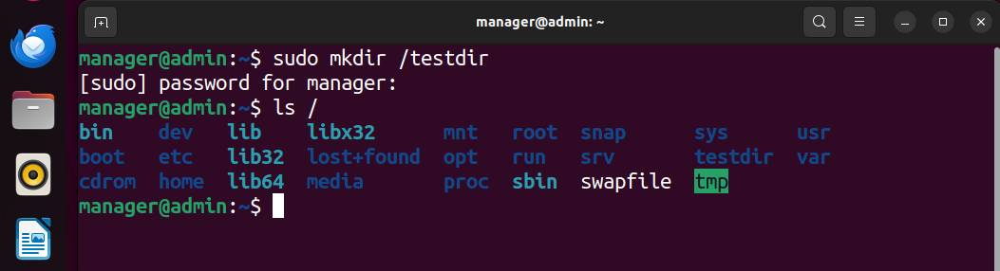

## Goal

Set up alerts to monitor when execute permissions are granted to shell scripts, ensuring that potentially harmful scripts are flagged before execution to prevent data loss or system damage.

## Setup Instructions 
## At Ubuntu Endpoint
1. Create a directory e.g. `/testdir` 

