## Goal

Set up alerts to monitor when execute permissions are granted to shell scripts, ensuring that potentially harmful scripts are flagged before execution to prevent data loss or system damage.

## Setup Instructions 
## At Ubuntu Endpoint
1. Create a directory e.g. `/testdir` 
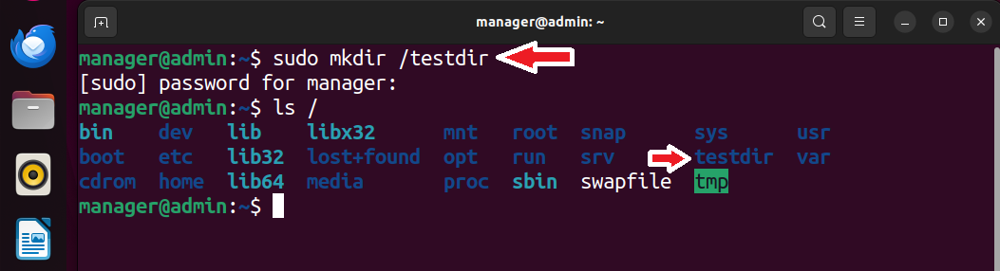 
2. Create a script file in the directory e.g. `testscript.sh` and check its permissions 
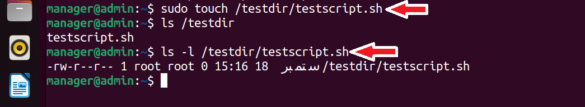 
3. Put this script file on monitoring from */var/ossec/etc/ossec.conf* file of Ubuntu agent. 
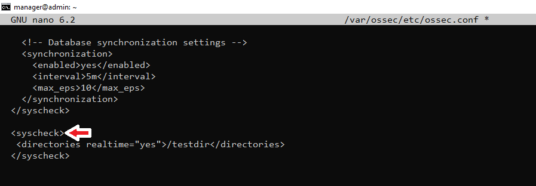 
4. Verify that monitoring is started by checking this file in the **Inventory** of FIM module in Wazuh dashboard.  
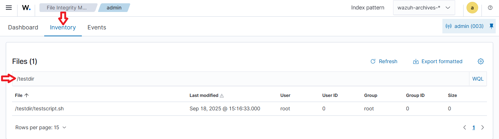 
5. Modify file (add some text) and check alert is generated or not. 
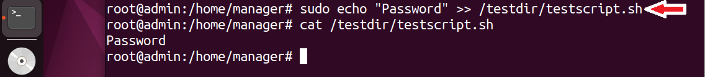 
Check this in the **Events** of FIM module, 
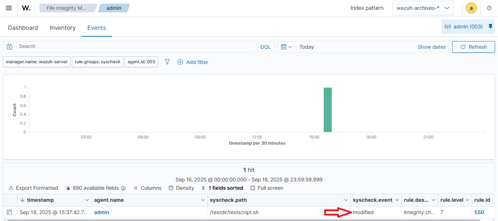 
7. Now cheange the permissions of file and analyze what alert is generated,  
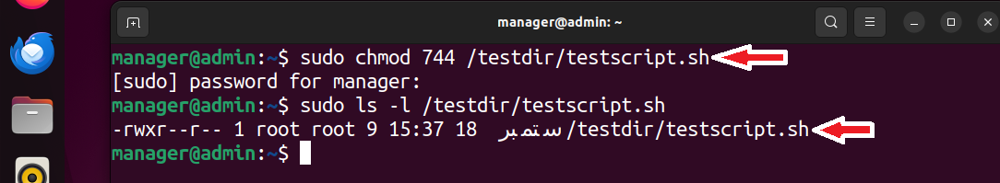 
Check this in the **Events** of FIM module, Integrity Check rule is triggered again (id 550), not specific rule for permission change 
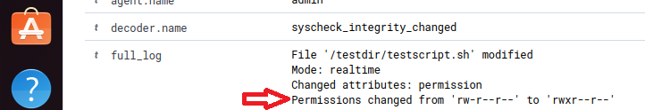 
That's why we need to write a custom rule. 
But before, revert the changes, 
 
## At Wazuh Manager
8. Create a file for custom FIM rule */var/ossec/etc/rules/fim_custom_rules.xml*, add the custom rule to generate alert for change in execution permissions for scipt files, 
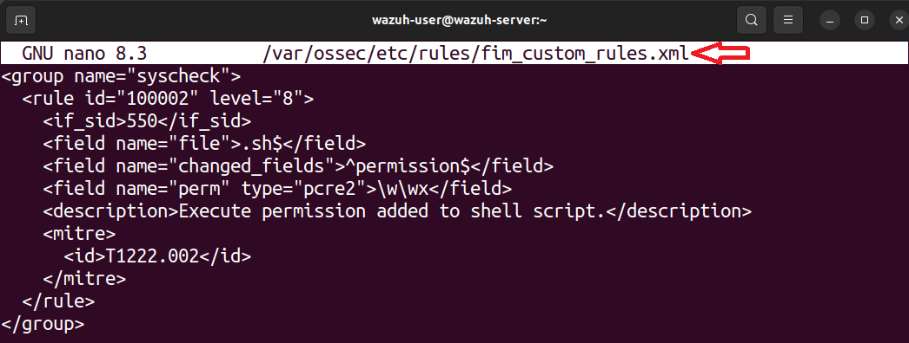
9. Restart wazuh manager `sudo systemctl restart wazuh-manager`
10. Again change the permissions of script file (at Ubuntu endpoint) and observe custom rule is triggered, 
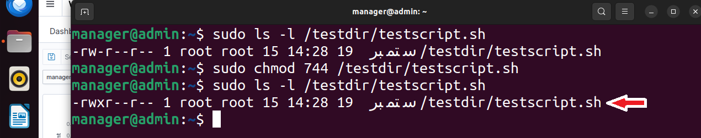
Check this in the **Events** of FIM module, 
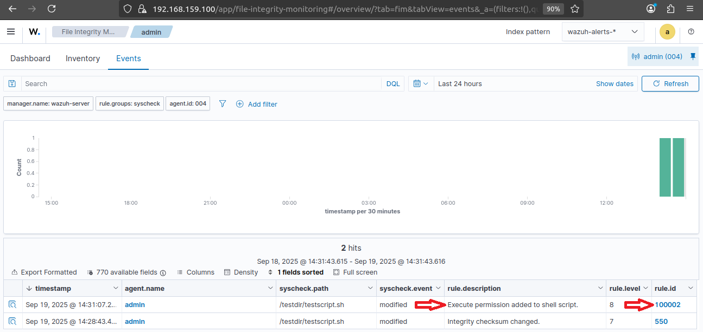
Now the custom permission check rule is triggered. 
