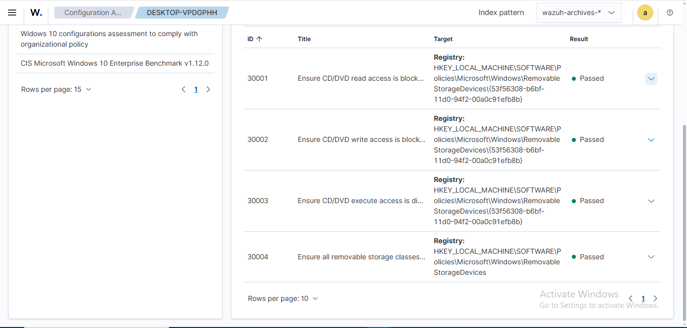
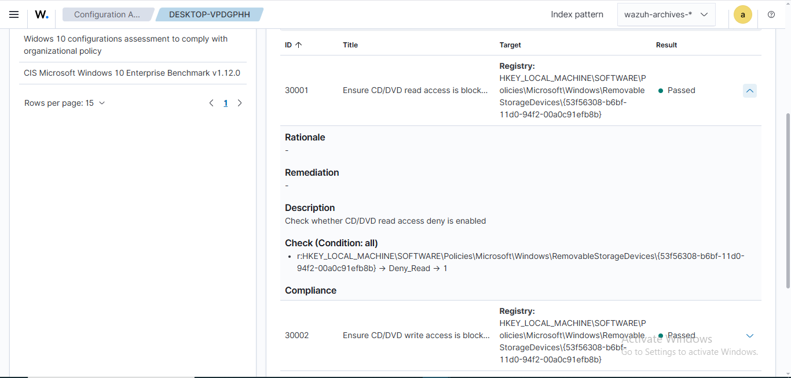

## Goal

The goal of this project is security configuration assessment of all removable storage devices (such as USB drives and CD/DVDs) on endpoints using Wazuh. This includes detecting any read, write, or execution configuration enabled from such devices and monitoring at SCA module of Wazuh dashboard.

## Setup Instructions 
### 1. Requirement Section of .yml file
To apply this check only on Windows 10 systems, you need to define a rule within the requirement block of the .yml file. On Windows, you can verify the product name by querying the registry using the following command:<br>
`reg query "HKEY_LOCAL_MACHINE\SOFTWARE\Microsoft\Windows NT\CurrentVersion" /v ProductName`<br><br>
 <br><br>
You can also verify this manually using the Registry Editor: press Windows key + R, type regedit, and navigate to
*HKEY_LOCAL_MACHINE\SOFTWARE\Microsoft\Windows NT\CurrentVersion*.<br>
 <br><br>
So, the rule for requirement block will be `'r:HKEY_LOCAL_MACHINE\SOFTWARE\Microsoft\Windows NT\CurrentVersion -> ProductName -> r:^Windows 10'`
### 2. Checks Section of .yml file
i. Wazuh rules to detect when read, write, or execution access to CD/DVD devices is denied,<br><br>
`'r:HKEY_LOCAL_MACHINE\SOFTWARE\Policies\Microsoft\Windows\RemovableStorageDevices\{53f56308-b6bf-11d0-94f2-00a0c91efb8b} -> Deny_Read -> 1'`<br>
`'r:HKEY_LOCAL_MACHINE\SOFTWARE\Policies\Microsoft\Windows\RemovableStorageDevices\{53f56308-b6bf-11d0-94f2-00a0c91efb8b} -> Deny_Write -> 1'`<br>
`'r:HKEY_LOCAL_MACHINE\SOFTWARE\Policies\Microsoft\Windows\RemovableStorageDevices\{53f56308-b6bf-11d0-94f2-00a0c91efb8b} -> Deny_Execute -> 1'`<br>
ii. Wazuh rules to detect all removable storage classes access denied,<br><br>
`'r:HKEY_LOCAL_MACHINE\SOFTWARE\Policies\Microsoft\Windows\RemovableStorageDevices -> Deny_All -> 1'`<br><br>
iii. On the Wazuh agent, edit the local_internal_options.conf file to allow the execution of commands in SCA policies sent from the Wazuh server. On Windows agent navigate to *C:\Program Files (x86)\ossec-agent*
and add `sca.remote_commands=1` in **local_internal_options.conf** file.<br>
 <br><br>
 <br><br>
iv. If file has no write permission, edit the properties of file.
#### Possible respose 
 <br><br>
#### Navigate to *security* ta in properties
 <br><br>
#### Tick the write permission
 <br><br>
#### Write permission is enabled now
 <br><br>
v. On the Wazuh server, place a new policy file in the /var/ossec/etc/shared/default/win_10_custom_sca.yml, using `sudo nano /var/ossec/etc/shared/default/win_10_custom_sca.yml`. Copy SCA policy and save the file (CTRL + O).
 <br><br>
vi. On the Wazuh server navigate to */var/ossec/etc/shared/default/agent.conf* and add following block to tell Wazuh Server scan custom sca policy. 
```
<agent_config>
  <sca>
    <policies>
        <policy enabled="yes">C:\Program Files (x86)\ossec-agent\shared\win_10_custom_sca.yml</policy>
    </policies>
  </sca>
</agent_config>
```
and save file.<brr> 
vii. Restart wazuh agent, for any error you can check wazuh agent logs, 
 <br><br>
viii. Check SCA Module in Wazuh Dashboard for targeted endpoints, 
 <br><br>
ix. Check are **Not Applicable** because these registry values are not configured,  
 <br><br>
#### Registry Values at the endpoint
 <br><br>
x. Configure these as Access Denied = Enabled, 
 <br><br>
#### Now Access Deny = Enabled
 <br><br>
xi. Force group policy from cmd, 
 <br><br>
xii. Again restart wazuh agent and check at Wazuh Dashboard for SCA checks, 
 <br><br>
 <br><br>
## Task Completed :)
