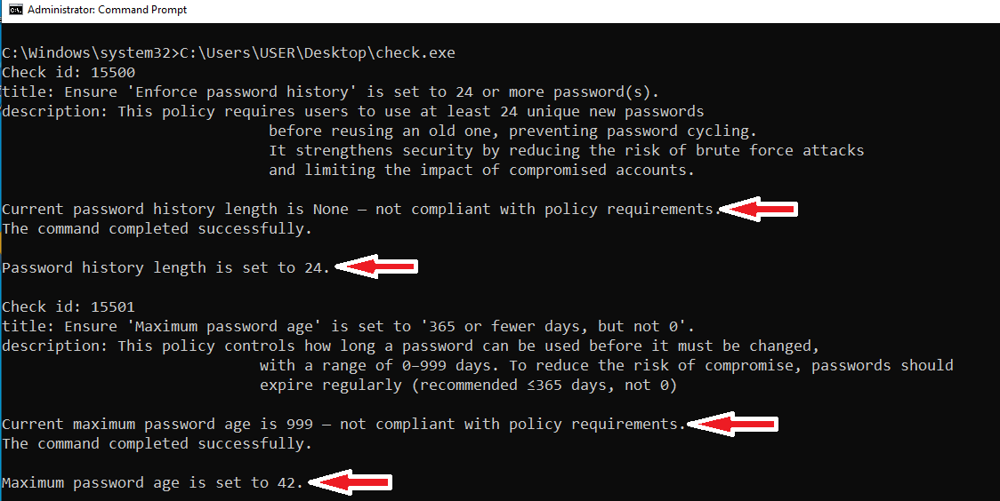
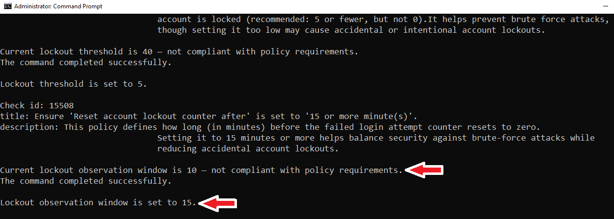
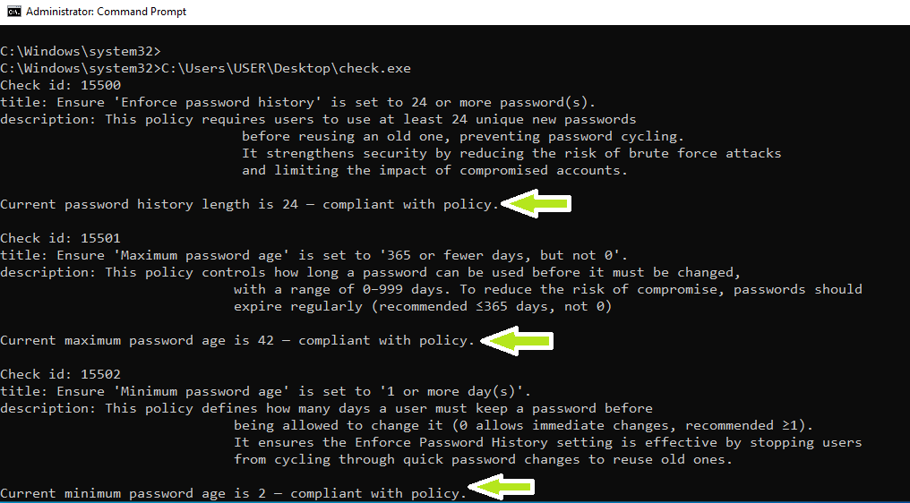

## Goal

The objective of this task is to develop a Python-based solution (packaged as an executable) that automates the verification and remediation of `net accounts` settings in alignment with the CIS Windows 10 Benchmark. This will reduce reliance on manual UI-based corrections suggested by the Wazuh SCA module, thereby saving time and effort while ensuring consistent compliance.

## Setup Instructions 
### 1. Development of Python Code and Executable file
[Python Code](cis_win10_benchmark_net_accounts_remediations.py) is developed and [.exe file](cis_win10_benchmark_net_accounts_remediations.exe) is created using pyinstaller.

### 2. Execute the .exe on a fresh, unconfigured Windows 10 system
#### Before execution 'net accounts' result
  
#### Execution 
  
  
  
  
#### After execution 'net accounts' result
Executing the program enforces the configured net accounts policies on the target Windows 10 system. 
  
#### Again execute the file
  

